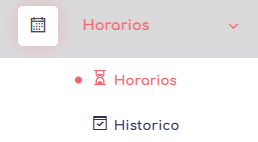

# Horarios

En este apartado podremos administrar todo los correspondiente a nuestros horarios.

las opciones que tenemos presentes son:

1. **Horarios:** Donde podremas observar los horarios que tienen nuestra empresa actual.
2. **Historico:** en este apartado podremos ver el historico de asignacion de horarios para nuestro usuario

 [volver](../2.Empleados.MD)   