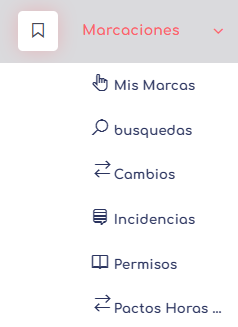

# Marcaciones

En las marcaciones, existen diferentes elementos a tener en cuenta, los cuales detallaremos a continuación para comprender la variedad de opciones en este nivel:

* **Mis Marcas:** Permite generar marcas desde nuestra web, para esto se tiene que habilitar la ubicacion y despues se generan las marcas con un simple click. Esta vista solo funciona si anteriormente la marcacion web es permitida por el administrador de la empresa.
* **[Búsqueda:](../../1.AdmoEmpresas/Marcaciones/MarcaBusqueda.md)** Permite buscar el listado de marcas de un trabajador por período. 
* **[Cambios:](./MarcaCambios.md)** Permite generar cambios o simplemente marcar la asistencia de un empleado en un día/hora específico.
* **[Incidencias:](./MarcaIncidencia.md)** Permite observar los reclamos o notas generadas por los empleados de las empresas.
* **[Permisos:](./MarcaPermisos.md)** Permite gestionar permisos, vacaciones y otros tipos de ausencias de un trabajador en su jornada ordinaria de trabajo.
* **[Pacto Horas Extras:](../../1.AdmoEmpresas/Marcaciones/Marcaphe.md)** Permite ver, aceptar y/o rechazar los pactos de horas extras.

---
[volver](../1.AdmoEmpresas.MD)