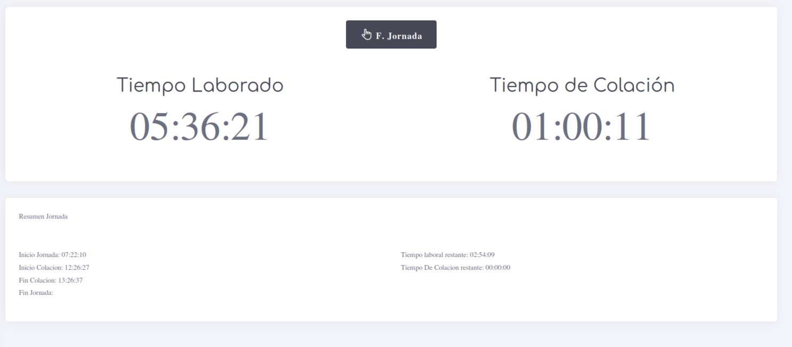
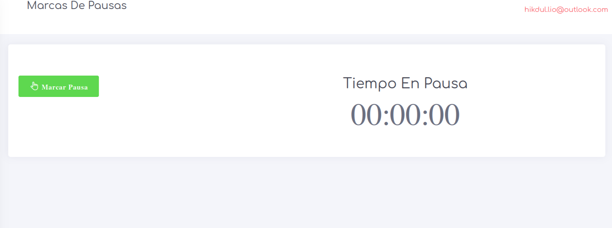
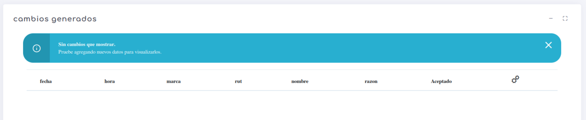
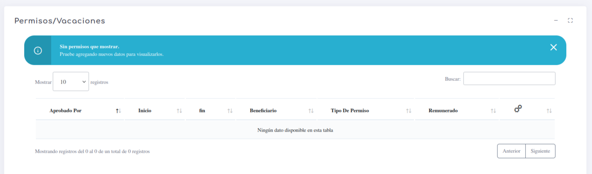
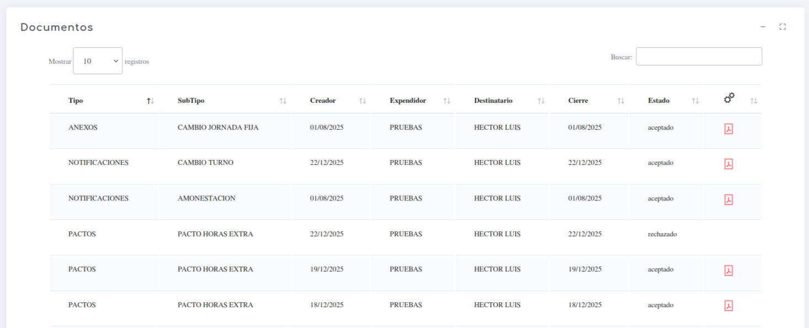
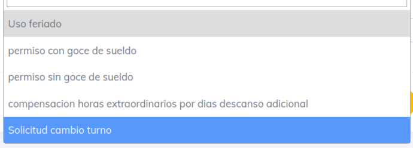
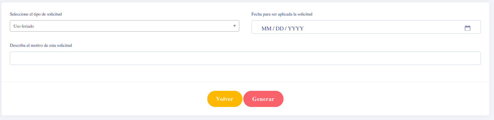

# Marcaciones

En las marcaciones, existen diferentes elementos a tener en cuenta, los cuales detallaremos a continuación para comprender la variedad de opciones en este nivel:

* **Mis Marcas**
* **Marcar Pausas**
* **[Búsqueda:](../../1.AdmoEmpresas/Marcaciones/MarcaBusqueda.md)** Permite buscar el listado de marcas de un trabajador por período. 
* **Cambios**
* **Permisos**
* **Documentos**
* **solicitudes**

### Mis Marcas

En esta opcion y si lo tenemos habilitado podremos realizar las marcas de manera web de modo sencillo

### Marcar Pausas

Son las marcas que si se encuentran habilitadas se pueden generar desde aca.

### Cambios

En este punto se puede observar, rechazar o validar algun cambion realizado.

### Permisos

aca se detallan los permisos, vacasiones, licencias y cualquier detalle de este estilo

### Documentos

en este punto podremos ver los documentos que aceptamos. Tambien aceptar o rechazar algun elemenos generado en este punto.

### Solicitudes

En este punto se pueden generar solicitudes para que desde Recursos Humanos las acepten o rechazen directamente; por el momento se encuentran habilitado los siguientes opciones

y para generar una solicitud se debe de completar el siguiente formulario

